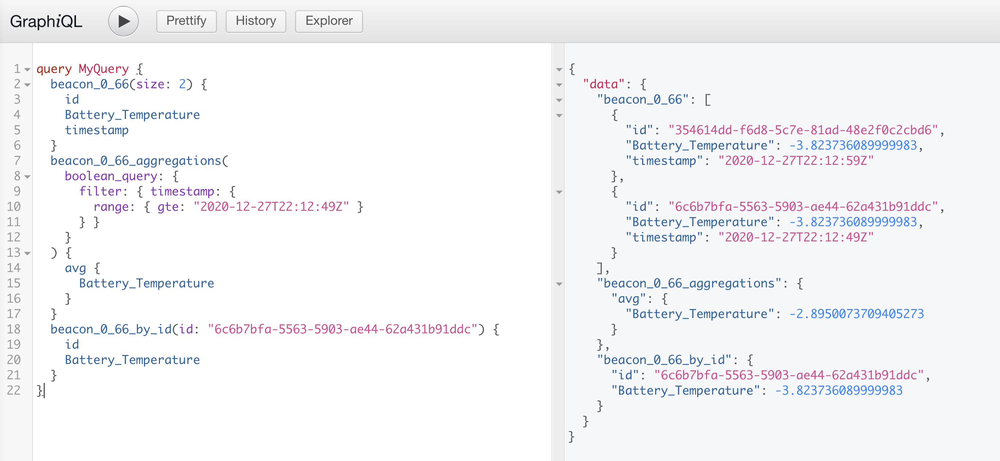

# Sturgeon :fish:

[](https://hub.docker.com/repository/docker/mewil/sturgeon)

Dynamic GraphQL API for [Elasticsearch](https://elastic.co/).



Sturgeon dynamically creates GraphQL schemas and resolvers for each index in an Elasticsearch cluster.
It currently provides schemas for querying documents by ID, a list of documents, and several simple aggregations.
Users can specify search parameters using the `boolean_query` argument, which supports boolean [range queries](https://www.elastic.co/guide/en/elasticsearch/reference/current/query-dsl-range-query.html) for float, integer and timestamp values.
More complex arguments and search options will be available soon.

_The above image shows example queries for the three GraphQL schemas generated from a single Elasticsearch index._ 

## Docker Quickstart

With Elasticsearch running on your local machine on port `9200`, use the following `docker run` command to start Sturgeon on
port `8080`. 
```shell script
docker run -e STURGEON_ELASTICSEARCH_HOSTS=http://host.docker.internal:9200 -e STURGEON_ENABLE_GRAPHIQL=true -p 8080:8080 --rm mewil/sturgeon:latest 
```
After the GraphQL schema is generated and the server is running, the [GraphiQL](https://github.com/graphql/graphiql) UI will be accessible at http://localhost:8080/graphql.

## Options

Sturgeon can be configured using the following environment variables:

| Variable                                       | Description                                                                                                                                                                                                                                    | Default |
| ---------------------------------------------- | ---------------------------------------------------------------------------------------------------------------------------------------------------------------------------------------------------------------------------------------------- | ------- |
| `STURGEON_ELASTICSEARCH_HOSTS`                 | A comma-separated list of Elasticsearch hosts including URL scheme (e.g. `http://host.docker.internal:9200`)                                                                                                                                   | `[] `   |
| `STURGEON_ELASTICSEARCH_INDEX_INCLUDE_PATTERN` | A pattern that determines which Elasticsearch indices are used to create GraphQL schemas, see the [Elasticsearch Get Mapping API](https://www.elastic.co/guide/en/elasticsearch/reference/master/indices-get-mapping.html) for possible values | `"*"`   |
| `STURGEON_FIELD_IGNORE_PREFIX`                 | A regular expression that can be used to ignore document field prefixes when generating a GraphQL schema                                                                                                                                       | `".*"`  |
| `STURGEON_ENABLE_AGGREGATIONS`                 | Used to enable or disable aggregation schemas                                                                                                                                                                                                  | `true`  |
| `STURGEON_ENABLE_GRAPHIQL`                     | Used to enable or disable a [GraphiQL](https://github.com/graphql/graphiql) web interface                                                                                                                                                      | `false` |
| `STURGEON_ENABLE_QUERY_LOGGING`                | Used to enable or disable logging of queries sent to Elasticsearch                                                                                                                                                                             | `true`  |
| `STURGEON_ENABLE_QUERY_RESULT_LOGGING`         | Used to enable or disable logging of query results from Elasticsearch                                                                                                                                                                          | `true`  |


_Disclaimer:_ Sturgeon is actively under development and may not behave as expected.